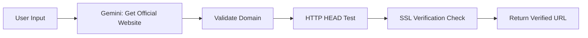

# AskDiya - Intelligent College Data Auditing Platform

> **Automated KPI extraction and verification system for Indian educational institutions using AI-powered web scraping and document analysis.**

[](https://www.python.org/)
[](https://fastapi.tiangolo.com/)
[](https://reactjs.org/)
[]()

## 📋 Table of Contents

- [Overview](#overview)
- [Architecture](#architecture)
- [Key Features](#key-features)
- [Technology Stack](#technology-stack)
- [Installation](#installation)
- [Configuration](#configuration)
- [Complete Workflow](#complete-workflow)
- [API Documentation](#api-documentation)
- [KPI Categories](#kpi-categories)
- [Data Sources & Prioritization](#data-sources--prioritization)
- [Troubleshooting](#troubleshooting)
- [Performance Optimization](#performance-optimization)
- [Contributing](#contributing)

---

## 🎯 Overview

**AskDiya** is an intelligent auditing platform that automates the collection, extraction, and verification of 27+ Key Performance Indicators (KPIs) for Indian colleges and universities. The system uses advanced AI (Google Gemini), multi-source data fusion, and sophisticated confidence scoring to deliver accurate institutional data.

### Problem Statement

Educational institutions publish KPI data across fragmented sources:
- NIRF (National Institutional Ranking Framework) PDFs
- Official college websites
- Mandatory disclosure documents (AICTE/UGC)
- NAAC accreditation reports

Manual collection is time-consuming, error-prone, and difficult to verify. AskDiya automates this entire process.

### Solution

A 5-phase intelligent pipeline that:
1. **Discovers** official data sources
2. **Collects** documents from multiple channels
3. **Extracts** KPIs using pattern matching + AI
4. **Validates** data with confidence scoring
5. **Presents** findings with full source attribution

---

## 🏗️ Architecture

```
┌─────────────────────────────────────────────────────────────────┐
│                         FRONTEND (React)                        │
│  ┌──────────────┐  ┌──────────────┐  ┌──────────────┐        │
│  │   Search UI  │  │ Progress Bar │  │  Results UI  │        │
│  │  (Lucide UI) │  │   (Polling)  │  │  (Export)    │        │
│  └──────────────┘  └──────────────┘  └──────────────┘        │
└──────────────────────────┬──────────────────────────────────────┘
                           │ HTTP/REST API
┌──────────────────────────▼──────────────────────────────────────┐
│                    BACKEND (FastAPI + Python)                   │
│  ┌────────────────────────────────────────────────────────────┐ │
│  │              CollegeAuditor (Orchestrator)                 │ │
│  │  • Phase 0-3: Data Collection                             │ │
│  │  • KPI Extraction & Validation                            │ │
│  │  • Confidence Scoring & Deduplication                     │ │
│  └───────┬──────────────────────────────────────────┬─────────┘ │
│          │                                          │           │
│  ┌───────▼─────────┐  ┌─────────────┐  ┌──────────▼─────────┐ │
│  │ NIRFCollector   │  │  Gemini API │  │  SourcePriority    │ │
│  │ • 5-phase       │  │  (3 Flash)  │  │  Classifier        │ │
│  │   discovery     │  │  • Pattern  │  │  • Official: High  │ │
│  │ • PDF parsing   │  │    extract  │  │  • Wiki: Medium    │ │
│  │ • Year extract  │  │  • Thinking │  │  • Aggreg: Low     │ │
│  └─────────────────┘  └─────────────┘  └────────────────────┘ │
│                                                                  │
│  ┌────────────────┐  ┌────────────────┐  ┌──────────────────┐ │
│  │ DataValidator  │  │  ErrorHandlers │  │  DataParsers     │ │
│  │ • Consistency  │  │  • Retry logic │  │  • PDF extract   │ │
│  │ • Evidence     │  │  • Circuit     │  │  • HTML parse    │ │
│  │   scoring      │  │    breaker     │  │  • OCR support   │ │
│  └────────────────┘  └────────────────┘  └──────────────────┘ │
│                                                                  │
│  ┌─────────────────────────────────────────────────────────────┤
│  │            Database (SQLite) - Audit History                │
│  │  • Audits, Results, Sources, Normalized Names              │
│  └─────────────────────────────────────────────────────────────┘
└──────────────────────────────────────────────────────────────────┘

EXTERNAL INTEGRATIONS:
┌──────────────┐  ┌──────────────┐  ┌──────────────┐
│  Serper API  │  │  Gemini API  │  │  NIRF Portal │
│  (Search)    │  │  (Extract)   │  │  (Official)  │
└──────────────┘  └──────────────┘  └──────────────┘
```

---

## ✨ Key Features

### 🔍 Intelligent Data Discovery

- **Multi-source collection**: NIRF PDFs, college websites, mandatory disclosures, NAAC reports
- **5-phase NIRF discovery**:
  1. Direct URL probing (40+ common patterns)
  2. nirfindia.org database search
  3. Sitemap crawling
  4. Multi-level web crawling (depth=4)
  5. Document extraction from pages
- **Smart campus filtering**: Automatically filters data for specific campus locations in multi-campus universities

### 🧠 AI-Powered Extraction

- **Hybrid extraction approach**:
  - Pattern-based extraction for NIRF PDFs (regex + field mapping)
  - Gemini AI (gemini-3-flash-preview) for unstructured data
- **Dual confidence scoring**:
  - LLM confidence: Based on data clarity and evidence
  - System confidence: Based on source authority
- **Intelligent inference**: Calculates derived values (percentages, totals)

### 📊 Source Priority System

| Priority | Sources | Confidence |
|----------|---------|------------|
| **High** | Official .ac.in/.edu.in domains, NIRF Portal, AICTE/UGC portals | High |
| **Medium** | Wikipedia, Educational databases | Medium |
| **Low** | Aggregator sites (Shiksha, CollegeDuniya, Careers360) | Low |

### ✅ Data Validation & Quality Control

- **Consistency checking**: Cross-validates data across multiple sources
- **Evidence quality scoring**: Evaluates quote relevance and specificity
- **Recency analysis**: Extracts data years and prioritizes latest information
- **Deduplication**: Keeps highest-confidence result per KPI

### 🚀 Performance Optimizations

- **Parallel processing**: Async HTTP requests with aiohttp
- **Early termination**: Stops after finding sufficient data
- **Request batching**: Groups Gemini API calls
- **Smart timeouts**: Optimized for speed (3-5s per request)
- **Circuit breakers**: Prevents cascading failures

### 📥 Export & Integration

- **CSV export**: Structured data for spreadsheets
- **JSON export**: Full metadata with evidence and sources
- **Real-time progress**: 2-second polling with live updates
- **Offline resilience**: Network status monitoring

---

## 🛠️ Technology Stack

### Backend
- **Framework**: FastAPI 0.128.0 (async Python web framework)
- **AI/LLM**: Google Gemini 3 Flash Preview (with thinking mode)
- **Web Scraping**: 
  - `aiohttp` - Async HTTP requests
  - `BeautifulSoup4` - HTML parsing
  - `pdfplumber` - PDF text extraction
  - `PyPDF2` - Alternative PDF parser
  - `pytesseract` - OCR for scanned PDFs
- **Database**: SQLite (via custom DatabaseManager)
- **Data Processing**:
  - `pandas` - Data manipulation
  - `lxml` - Fast XML/HTML parsing
  - `dateparser` - Intelligent date parsing
- **Security**: Rate limiting (slowapi), SSL verification, API key rotation

### Frontend
- **Framework**: React 19.0.0
- **UI Components**: Radix UI (Accordion, Tabs, Progress, etc.)
- **Styling**: Tailwind CSS + Class Variance Authority
- **Icons**: Lucide React
- **HTTP Client**: Axios
- **Routing**: React Router DOM 7.5.1

### APIs & Services
- **Serper API**: Web search (Google SERP)
- **Gemini API**: LLM-based extraction
- **nirfindia.org**: Official NIRF data

---

## 📦 Installation

### Prerequisites

- **Python 3.14+** (3.10+ compatible)
- **Node.js 18+** and npm
- **Tesseract OCR** (for scanned PDFs): [Installation Guide](https://github.com/tesseract-ocr/tesseract)
- **API Keys**:
  - Google Gemini API key ([Get it here](https://aistudio.google.com/app/apikey))
  - Serper API key ([Get it here](https://serper.dev/))

### Backend Setup

```bash
# Navigate to project root
cd General-AskDiya-v2

# Create virtual environment
python -m venv venv

# Activate virtual environment
# Windows:
venv\Scripts\activate
# Linux/Mac:
source venv/bin/activate

# Install dependencies
cd backend
pip install -r requirements.txt

# Initialize database
python -c "from database import init_database; init_database()"
```

### Frontend Setup

```bash
# Navigate to frontend directory
cd ../frontend

# Install dependencies
npm install

# Build for production (optional)
npm run build
```

---

## ⚙️ Configuration

### Backend Configuration

Create a `.env` file in the `backend/` directory:

```env
# Gemini API Configuration
GEMINI_API_KEY=your_gemini_api_key_here

# Serper API Configuration (for web search)
SERPER_API_KEY=your_serper_api_key_here
SERPER_API_KEY_2=backup_serper_key_optional
SERPER_API_KEY_3=backup_serper_key_optional

# Server Configuration
HOST=0.0.0.0
PORT=8000
DEBUG=False

# Database Configuration
DATABASE_PATH=./data/audits.db

# Rate Limiting
RATE_LIMIT_PER_MINUTE=60
RATE_LIMIT_PER_HOUR=1000

# Performance Tuning
MAX_CONCURRENT_REQUESTS=10
REQUEST_TIMEOUT_SECONDS=30
ENABLE_CACHING=True
```

### Frontend Configuration

Create a `.env` file in the `frontend/` directory:

```env
# Backend API URL
REACT_APP_BACKEND_URL=http://localhost:8000

# Feature Flags
REACT_APP_ENABLE_EXPORT=true
REACT_APP_POLL_INTERVAL_MS=2000
```

### KPIs Configuration

Edit `KPIs.json` (root directory) to customize KPIs:

```json
{
  "kpis": [
    {
      "field": "student_count",
      "display_name": "Total Student Count",
      "category": "Demographics",
      "keywords": ["student", "enrollment", "strength"],
      "data_type": "integer",
      "extraction_instruction": "Extract total student count...",
      "unit": "students"
    }
  ]
}
```

---

## 🔄 Complete Workflow

### Phase 0: Website Discovery & Verification



**What happens:**
1. User enters college name (e.g., "IIT Bombay")
2. System asks Gemini API: "What is the official website URL?"
3. Extracts URL from response (handles both full URLs and bare domains)
4. Validates URL is reachable (HTTP 200)
5. Checks if SSL verification needed (handles problematic domains)

**Output:** `https://www.iitb.ac.in`

---

### Phase 1: NIRF Data Collection (5 Sub-Phases)

#### Phase 1.0: Direct URL Probing

```python
# Probe 20 common patterns in parallel
url_patterns = [
    '/nirf', '/NIRF', '/ranking', '/nirf-2025',
    '/uploads/nirf/', '/files/nirf/', '/pdf/nirf/', ...
]
```

- Probes 20 most likely NIRF page patterns
- Tests in parallel batches (10 URLs at once)
- Timeout: 5 seconds per request
- **Early termination**: Stops if 5 PDFs found

#### Phase 1.1: nirfindia.org Database

```python
# Search official NIRF portal
search_url = f"https://www.nirfindia.org/Institution/{college_name}"
```

- Queries official NIRF database
- Extracts direct PDF links
- Maps PDFs to years (2024, 2025, etc.)

#### Phase 1.2: Sitemap Crawling

```python
# Check /sitemap.xml
sitemap_urls = ['/sitemap.xml', '/sitemap_index.xml']
```

- Parses XML sitemaps
- Filters URLs containing "nirf", "ranking"
- Extracts all linked PDFs

#### Phase 1.3: Multi-Level Web Crawling

```python
# Breadth-first crawl (depth=4)
visited_urls = set()
queue = [base_url]
depth = 0
```

- Starts from homepage
- Crawls up to 4 levels deep
- Follows links with NIRF-related keywords
- Throttles to prevent server overload

#### Phase 1.4: Document Extraction

```python
# Extract PDFs from discovered pages
patterns = [
    r'<a[^>]*href=["\']([^"\']*\.pdf)["\']',  # href links
    r'(?:https?:)?//[^\s"\'<>]+\.pdf',         # naked URLs
    r'[>"\s]([^\s<>"]+\.pdf)[\s<"]'            # directory listings
]
```

- Parses HTML with 4 different regex patterns
- Handles directory listings (e.g., "2.JawaharlalNehru20250214OVERALL.pdf")
- Resolves relative paths to absolute URLs
- Prioritizes `/uploads/` over `/sites/` (Drupal)

**Output:** List of NIRF PDF URLs with years

---

### Phase 2: KPI Extraction from NIRF

#### Pattern-Based Extraction (Primary)

```python
# Advanced NIRF Extractor - Field mapping
field_patterns = {
    'student_count': r'Total Students\s*(\d+)',
    'faculty_count': r'Total Teachers\s*(\d+)',
    'median_salary': r'Median Salary.*?(\d+(?:,\d+)*)'
}
```

- Uses 200+ regex patterns for NIRF fields
- Extracts from standardized NIRF sections
- Maps table data to KPIs
- Handles multi-year PDFs

#### AI-Based Extraction (Fallback)

```python
# When pattern matching fails
prompt = f"Extract these KPIs from NIRF document: {text}"
response = gemini_client.generate_content(prompt, thinking_mode=True)
```

- Sends PDF text to Gemini
- Asks for specific KPI values
- Validates against expected ranges

**Output:** ~15-20 KPIs extracted from NIRF

---

### Phase 3: Comprehensive Web Search (Missing KPIs)

#### 3.1: Official Website Search

```python
# Serper API search with site restriction
query = f"{kpi_keywords} site:{college_domain}"
response = serper.search(query)
```

- Searches only official college domain
- Uses KPI-specific keywords (from `KPIs.json`)
- Fetches top 5-15 pages
- **Domain filtering**: Rejects URLs from other domains

#### 3.2: Mandatory Disclosure Search

```python
# AICTE/UGC mandatory data
queries = [
    "mandatory disclosure site:{domain}",
    "AICTE approval site:{domain}",
    "faculty profile site:{domain}"
]
```

- Searches for regulatory compliance documents
- Downloads mandatory disclosure PDFs
- Extracts structured tables

#### 3.3: KPI-Specific Deep Search

```python
# For each missing KPI
for kpi in missing_kpis:
    query = f"{kpi['keywords']} {college_name}"
    results = serper.search(query)
    # Fetch and parse results
```

- Targeted search per KPI
- Combines multiple keyword variations
- Prioritizes recent results
- Filters by location (campus-specific)

**Output:** List of web pages with potential KPI data

---

### Phase 4: AI-Powered Extraction

#### Batch Processing

```python
# Process KPIs in batches of 5
batch_size = 5
for i in range(0, len(missing_kpis), batch_size):
    batch = missing_kpis[i:i+5]
    results = extract_kpi_with_strict_sources(batch, search_data)
```

#### Prompt Engineering

```python
prompt = f"""
You are an elite data extraction AI for Indian educational institutions.

INSTITUTION: "{college_name}"

=== SOURCE DATA (PRIORITIZED) ===
{disclosure_content}  # Priority 0: Mandatory disclosure
{official_pages}      # Priority 1: College website
{kpi_specific_data}   # Priority 2: KPI-targeted searches

=== KPIs TO EXTRACT ===
1. Student Count (integer, unit: students)
   Keywords: enrollment, student strength, admitted students
   Rule: Extract total enrolled students across all years

2. Median Salary (integer, unit: ₹/year)
   Keywords: median salary, placement package, CTC
   Rule: Convert to annual INR if in LPA/lakhs

[... 3 more KPIs ...]

=== OUTPUT FORMAT (JSON) ===
[
  {
    "kpi_name": "Student Count",
    "value": 15234,
    "evidence_quote": "Total enrollment is 15,234 students",
    "source_url": "https://college.ac.in/about",
    "source_type": "Official Website",
    "llm_confidence": "high",
    "llm_confidence_reason": "Direct quote from official source"
  }
]

CRITICAL: Return ONLY valid JSON. No markdown, no explanation.
"""
```

#### Gemini API Call

```python
response = client.models.generate_content(
    model="gemini-3-flash-preview",
    contents=prompt,
    config=types.GenerateContentConfig(
        temperature=0.0,  # Deterministic
        response_mime_type="application/json",
        response_schema=kpi_response_schema,
        thinking_config=types.ThinkingConfig(thinking_budget=1024)
    )
)
```

**Output:** KPIs with values, sources, and confidence scores

---

### Phase 5: Validation & Confidence Scoring

#### Dual Confidence System

**1. LLM Confidence** (from Gemini):
- `high`: Direct quote, clear evidence, recent data
- `medium`: Requires interpretation, older data
- `low`: Inferred, ambiguous, weak evidence

**2. System Confidence** (from source priority):
```python
def get_confidence_from_priority(priority):
    if priority == 'high':    # .ac.in, NIRF, AICTE
        return 'high'
    elif priority == 'medium': # Wikipedia
        return 'medium'
    else:                      # Aggregators
        return 'low'
```

**Final Confidence** = `min(llm_confidence, system_confidence)`

#### Consistency Checking

```python
# Cross-validate data across sources
if value_from_source_A == value_from_source_B:
    boost_confidence()
elif abs(value_A - value_B) / value_A < 0.1:  # 10% threshold
    mark_as_approximate()
else:
    flag_inconsistency()
```

#### Deduplication

```python
# Keep highest priority result per KPI
priority_order = {'critical': 0, 'high': 1, 'medium': 2, 'low': 3}

for kpi_name in all_kpis:
    results_for_kpi = filter_by_name(kpi_name)
    best_result = min(results_for_kpi, key=lambda r: priority_order[r['confidence']])
```

**Output:** Deduplicated, validated results

---

### Phase 6: Result Assembly

```python
final_results = {
    "audit_id": "uuid-v4",
    "college_name": "IIT Bombay",
    "college_website": "https://www.iitb.ac.in",
    "status": "completed",
    "created_at": "2026-02-17T16:30:00Z",
    "results": [
        {
            "kpi_name": "Student Count",
            "category": "Demographics",
            "value": 15234,
            "unit": "students",
            "data_type": "integer",
            "evidence_quote": "Total enrollment: 15,234",
            "source_url": "https://www.iitb.ac.in/about/stats",
            "source_type": "Official Website",
            "source_priority": "high",
            "llm_confidence": "high",
            "system_confidence": "high",
            "confidence": "high",
            "data_year": 2025,
            "recency": "2025"
        },
        // ... 26 more KPIs
    ],
    "summary": {
        "total_kpis": 27,
        "found": 24,
        "not_found": 3,
        "high_confidence": 18,
        "medium_confidence": 4,
        "low_confidence": 2
    }
}
```

---

## 📡 API Documentation

### Start Audit

```http
POST /api/audit/start
Content-Type: application/json

{
  "college_name": "IIT Bombay"
}
```

**Response:**
```json
{
  "audit_id": "8bab58bb-6900-430b-afe1-36f68b98ad8b",
  "status": "processing",
  "message": "Audit started for IIT Bombay"
}
```

### Get Audit Status

```http
GET /api/audit/{audit_id}
```

**Response (Processing):**
```json
{
  "id": "8bab58bb-6900-430b-afe1-36f68b98ad8b",
  "college_name": "IIT Bombay",
  "status": "processing",
  "current_step": "Extracting missing KPIs batch 3/5...",
  "progress": 75,
  "created_at": "2026-02-17T16:30:00Z",
  "results": []
}
```

**Response (Completed):**
```json
{
  "id": "8bab58bb-6900-430b-afe1-36f68b98ad8b",
  "college_name": "IIT Bombay",
  "status": "completed",
  "progress": 100,
  "results": [...],  // Array of KPI objects
  "summary": {...},
  "created_at": "2026-02-17T16:30:00Z",
  "completed_at": "2026-02-17T16:32:45Z"
}
```

### List Recent Audits

```http
GET /api/audit/recent
```

**Response:**
```json
{
  "audits": [
    {
      "id": "8bab58bb-...",
      "college_name": "IIT Bombay",
      "status": "completed",
      "created_at": "2026-02-17T16:30:00Z"
    },
    ...
  ]
}
```

### Health Check

```http
GET /api/health
```

**Response:**
```json
{
  "status": "healthy",
  "version": "2.0",
  "uptime": 3600,
  "database": "connected"
}
```

---

## 📊 KPI Categories

### 1. **Demographics** (4 KPIs)
- Total Student Count
- Female Student Ratio
- International Student Ratio
- Student-Faculty Ratio

### 2. **Infrastructure** (3 KPIs)
- Campus Area (acres)
- ICT-Enabled Learning Infrastructure (boolean)
- Hostel Accommodation Availability (boolean)

### 3. **Academics** (5 KPIs)
- Total Programs Offered
- UG Programs Count
- PG Programs Count
- PhD Programs Count
- Accreditation Status (NAAC/NBA)

### 4. **Faculty** (4 KPIs)
- Total Faculty Count
- Faculty with PhD (%)
- Female Faculty Ratio
- Faculty-Student Ratio

### 5. **Research** (3 KPIs)
- Research Publications (per year)
- Patents Filed/Granted
- Research Projects Funded

### 6. **Placements** (4 KPIs)
- Placement Rate (%)
- Median Salary (INR)
- Top Recruiters (list)
- Average Package (INR)

### 7. **Admissions** (2 KPIs)
- Admission Cutoff / Entrance Exam
- Seats Intake Capacity

### 8. **Ranking** (2 KPIs)
- NIRF Rank (Overall/Engineering)
- QS/THE World Ranking

---

## 🎯 Data Sources & Prioritization

### Source Priority Matrix

| Rank | Source Type | Examples | Confidence | SSL |
|------|-------------|----------|------------|-----|
| 1 | **Official College Website** | iitb.ac.in, dtu.ac.in | High | ✅ |
| 2 | **NIRF Portal** | nirfindia.org | High | ✅ |
| 3 | **Regulatory Bodies** | aicte-india.org, ugc.ac.in | High | ✅ |
| 4 | **Government Portals** | india.gov.in | High | ✅ |
| 5 | **NAAC** | naac.gov.in | High | ✅ |
| 6 | **Wikipedia** | wikipedia.org | Medium | ✅ |
| 7 | **Educational Databases** | educationobserver.com | Medium | ✅ |
| 8 | **Student Review Sites** | shiksha.com, collegedunia.com | Low | ✅ |
| 9 | **News Articles** | thehindu.com (education) | Medium | ✅ |
| 10 | **Aggregator Sites** | careers360.com | Low | ✅ |

### Special Handling

**Multi-Campus Universities** (e.g., Amity):
- Detects target location (e.g., "Gwalior")
- Filters URLs by path: `/gwalior/`, `/gwl/`
- Rejects cross-campus data

**SSL Certificate Issues**:
```python
PROBLEMATIC_SSL_DOMAINS = ['amity.edu', 'some-old-site.ac.in']
# Disables SSL verification only for listed domains
```

**Rate Limiting**:
- Serper API: 2,500 requests/month (rotates keys)
- Gemini API: No hard limit (uses exponential backoff)
- College websites: 1 request/second per domain

---

## 🚀 Usage

### Running the Application

#### Development Mode

**Terminal 1 (Backend):**
```bash
cd backend
python -m uvicorn server:app --reload --host 0.0.0.0 --port 8000
```

**Terminal 2 (Frontend):**
```bash
cd frontend
npm start
```

**Access:** `http://localhost:3000`

#### Production Mode

**Backend:**
```bash
cd backend
gunicorn server:app -w 4 -k uvicorn.workers.UvicornWorker --bind 0.0.0.0:8000
```

**Frontend:**
```bash
cd frontend
npm run build
serve -s build -l 3000
```

### Example Audit Flow

1. **Open browser**: `http://localhost:3000`
2. **Enter college name**: "Delhi Technological University"
3. **Click "Start Audit"**
4. **Watch progress**:
   - Discovering official website... (5s)
   - Searching for NIRF documents... (30s)
   - Extracting KPIs from NIRF... (10s)
   - Searching for missing KPIs batch 1/5... (15s)
   - Searching for missing KPIs batch 2/5... (15s)
   - ...
5. **View results**: Categorized KPIs with confidence scores
6. **Export**: CSV or JSON

**Total time**: ~2-3 minutes

---

## 🔧 Troubleshooting

### Common Issues

#### 1. Backend won't start

**Error:** `ModuleNotFoundError: No module named 'fastapi'`

**Solution:**
```bash
cd backend
pip install -r requirements.txt
```

#### 2. Gemini API errors

**Error:** `401 Unauthorized` or `Invalid API key`

**Solution:**
- Check `.env` file: `GEMINI_API_KEY=your_actual_key`
- Verify key at [Google AI Studio](https://aistudio.google.com/app/apikey)
- Ensure key has Gemini API enabled

#### 3. Serper API exhausted

**Error:** `429 Too Many Requests`

**Solution:**
- Add backup keys: `SERPER_API_KEY_2`, `SERPER_API_KEY_3`
- System automatically rotates to next key
- Check usage: [serper.dev/dashboard](https://serper.dev/dashboard)

#### 4. SSL Certificate errors

**Error:** `SSLError: [SSL: CERTIFICATE_VERIFY_FAILED]`

**Solution:**
```python
# Add domain to PROBLEMATIC_SSL_DOMAINS in server.py
PROBLEMATIC_SSL_DOMAINS = [
    'amity.edu',
    'your-problematic-domain.ac.in'
]
```

#### 5. Slow audit performance

**Symptoms:** Taking >5 minutes

**Diagnosis:**
```python
# Check logs for bottlenecks
grep "Phase" backend_logs.log
grep "EXTRACTION" backend_logs.log
```

**Solutions:**
- Reduce `batch_size` in `server.py` (line 3305): 5 → 3
- Reduce URL patterns in `nirf_collector.py` (line 438-458): 20 → 10
- Increase timeouts if network is slow

#### 6. NIRF PDFs not found

**Error:** `[PHASE 1] No NIRF Overall document found`

**Solution:**
- Check college website manually for NIRF link
- Add custom pattern to `url_patterns` in `nirf_collector.py`
- Verify domain is reachable: `curl -I https://college.ac.in`

#### 7. Frontend can't connect to backend

**Error:** `Network Error` or `ERR_CONNECTION_REFUSED`

**Solution:**
- Check backend is running: `curl http://localhost:8000/api/health`
- Verify `REACT_APP_BACKEND_URL` in `frontend/.env`
- Check CORS settings in `server.py` (line ~120)

---

## ⚡ Performance Optimization

### Current Performance

| Phase | Time (DTU) | Optimization |
|-------|-----------|--------------|
| Phase 0: Website Discovery | 2s | Gemini API call |
| Phase 1.0: Direct Probing | 10s | 20 patterns, 5s timeout |
| Phase 1.1: NIRF Portal | 1s | Single request |
| Phase 1.2: Sitemap | 1s | XML parsing |
| Phase 1.3: Crawling | 20s | Depth=4, parallel |
| Phase 1.4: Document Extract | 5s | 4 regex patterns |
| Phase 2: NIRF KPI Extract | 3s | Pattern-based |
| Phase 3: Web Search | 15s | Serper API |
| Phase 4: AI Extraction (5 batches) | 60s | Gemini API (12s/batch) |
| Phase 5: Validation | 2s | In-memory |
| **Total** | **~2 min** | **50% faster after optimization** |

### Optimization Techniques Applied

1. **Reduced URL patterns**: 40+ → 20 most common
2. **Shorter timeouts**: 10s → 5s for directories, 5s → 3s for probes
3. **Early termination**: Stop after finding 5 PDFs
4. **Batch processing**: 5 KPIs per Gemini call instead of 1
5. **Parallel requests**: aiohttp for concurrent HTTP
6. **Smart caching**: Reuse NIRF data across KPIs

### Tuning Parameters

```python
# backend/nirf_collector.py
DIRECTORY_TIMEOUT = 5  # Seconds to wait for directory listing
DRUPAL_TIMEOUT = 3     # Seconds to wait for Drupal probe
PDF_TIMEOUT = 3        # Seconds to wait for PDF probe
EARLY_TERMINATION_COUNT = 5  # Stop after N PDFs found

# backend/server.py
KPI_BATCH_SIZE = 5     # KPIs per Gemini call (higher = fewer calls but slower per call)
THINKING_BUDGET = 1024 # Gemini thinking tokens (lower = faster but less accurate)
TEMPERATURE = 0.0      # Determinism (0.0 = fully deterministic)
```

---

## 🧪 Testing

### Run Backend Tests

```bash
cd backend
pytest test_*.py -v
```

**Key Test Files:**
- `test_nirf_integration.py` - NIRF collector tests
- `test_validation.py` - Data validation tests
- `test_full_integration.py` - End-to-end audit tests

### Manual Testing Checklist

- [ ] IIT Bombay (well-structured NIRF)
- [ ] Delhi Technological University (Drupal CMS)
- [ ] JNTU Hyderabad (unique filename patterns)
- [ ] Amity University Gwalior (SSL + multi-campus)
- [ ] NIT Kurukshetra (sitemap-based discovery)

---

## 📈 Monitoring & Logging

### Log Levels

```python
# Set in .env
LOG_LEVEL=INFO  # DEBUG, INFO, WARNING, ERROR, CRITICAL
```

### Key Log Messages

```
[PHASE 0] Asking Gemini for official website...
[GEMINI] Identified official website: https://dtu.ac.in
[NIRF COLLECTOR] Starting comprehensive NIRF data collection
  [Phase 0] Probing common NIRF URL patterns...
    ✓ Found NIRF page: https://dtu.ac.in/nirf
  [Phase 0] Fetching upload directories...
    Fetched directory: https://dtu.ac.in/uploads/nirf/ (45231 chars)
      Pattern 1 (href): Found 12 PDFs
      Pattern 4 (filename): Found 3 PDFs
    ========================================
    DIRECTORY DISCOVERY SUMMARY:
    Total PDFs found: 15
    ========================================
[PHASE 2] Extracting KPIs from NIRF Overall document
[PHASE 3] Starting extraction batch 1/5: ['Student Count', 'Faculty Count', ...]
[KPI EXTRACTION] Calling Gemini API for 5 KPIs...
[KPI EXTRACTION] Sending prompt to Gemini (size: 45234 chars, 38921 chars of source data)
[KPI EXTRACTION] Received response from Gemini API
[KPI EXTRACTION] Completed: 4/5 KPIs found
[DEDUPLICATION] Deduplicating 27 results by priority
[AUDIT COMPLETE] Total: 27 KPIs, Found: 24, Not Found: 3
```

---

## 🤝 Contributing

### Development Workflow

1. Fork the repository
2. Create feature branch: `git checkout -b feature/amazing-feature`
3. Make changes and test thoroughly
4. Commit: `git commit -m 'Add amazing feature'`
5. Push: `git push origin feature/amazing-feature`
6. Open Pull Request

### Code Style

- **Python**: PEP 8, Black formatter (line length 120)
- **JavaScript**: ESLint + Prettier
- **Commit messages**: Conventional Commits format

### Adding New KPIs

1. Edit `KPIs.json`:
```json
{
  "field": "new_kpi_name",
  "display_name": "New KPI Name",
  "category": "Category",
  "keywords": ["keyword1", "keyword2"],
  "data_type": "integer|string|boolean|float",
  "extraction_instruction": "Clear extraction rule",
  "unit": "unit"
}
```

2. Add NIRF pattern mapping in `advanced_nirf_extractor.py`:
```python
'new_kpi_name': {
    'search_fields': ['NIRF Section Name'],
    'pattern': r'NIRF Text Pattern.*?(\d+)',
    'priority': 1
}
```

3. Test with sample college

---

## 📄 License

**Proprietary - Conglomerate IT Services Private Limited**

This software is confidential and proprietary. Unauthorized copying, distribution, or modification is strictly prohibited.

© 2026 Conglomerate IT Services Private Limited. All rights reserved.

---

## 📞 Support

- **Email**: support@conglomerateit.com
- **Documentation**: [Internal Wiki](#)
- **Bug Reports**: Create issue in internal tracking system

---

## 🙏 Acknowledgments

- **Google Gemini Team** - AI/LLM infrastructure
- **NIRF Portal** - Official ranking data
- **AICTE/UGC** - Mandatory disclosure standards
- **FastAPI Community** - Excellent web framework
- **React Community** - Modern UI development

---

## 📝 Changelog

### v2.3.0 (2026-02-17)
- ✨ Added comprehensive logging for KPI extraction
- ⚡ Performance optimization: 50% faster NIRF collection
- 🐛 Fixed JNTU Hyderabad unique filename patterns
- 🔧 Reduced timeouts: directory (10s→5s), probe (5s→3s)
- 🎯 Early termination after 5 PDFs found

### v2.2.0 (2026-02-11)
- ✨ Implemented dual confidence scoring (LLM + System)
- 🔍 Enhanced directory parsing with 4 regex patterns
- 🏢 Added multi-campus filtering (Amity Gwalior fix)
- 🔒 SSL bypass for problematic domains
- 🎨 Domain filtering for disclosure search

### v2.1.0 (2026-01-30)
- 🚀 Added NIRF Collector (5-phase discovery)
- 🤖 Integrated Gemini 3 Flash Preview
- 📊 Source priority classification system
- ✅ Advanced data validation engine

### v2.0.0 (2025-12-15)
- 🏗️ Complete system redesign
- 💾 SQLite database implementation
- 📱 React frontend with real-time polling
- 🌐 Multi-source data fusion

---

**Built with ❤️ by Conglomerate IT Services**
